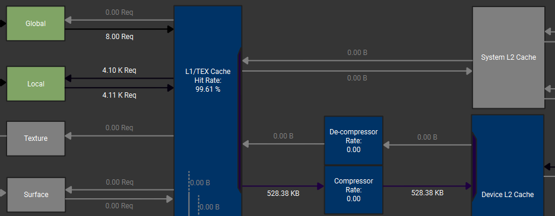

# Random Stuff

### tma_bw

Simple script to test TMA's capability to saturate the *L2* bandwidth.

```bash
bash run.sh
```

Also plot the heatmap like this one on RTX 5090:


### local_mem_write_policy

I came into a problem that the write traffic from L1 to L2 on GPU
is way higher than my expectation. After some research, the local
memory becomes very suspicious. This is a simple script to verify
that GPU handles local memory with a *write through* +
*write allocate* policy -- we have full write traffic but
none read traffic.

