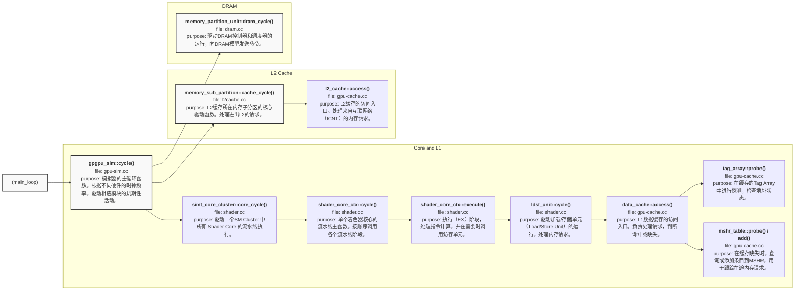

# Notes on GPGPU-Sim

- [Notes on GPGPU-Sim](#notes-on-gpgpu-sim)
  - [Configuration \& Statistics](#configuration--statistics)
    - [Updated](#updated)
    - [Updated, but NOT Necessary](#updated-but-not-necessary)
    - [Unchanged, but Confirmed](#unchanged-but-confirmed)
  - [Code Reading](#code-reading)
    - [SM Core](#sm-core)
      - [Pipeline: Reverse-Order Execution](#pipeline-reverse-order-execution)
    - [Memory Subsystem](#memory-subsystem)
      - [Calling Chain (wip)](#calling-chain-wip)
    - [PTX Opcode Parsing](#ptx-opcode-parsing)
      - [Calling Chain: From .ptx to function\_info](#calling-chain-from-ptx-to-function_info)
      - [Centralized Definition](#centralized-definition)
      - [Code Generation with X-Macros](#code-generation-with-x-macros)
    - [Debug: Trace](#debug-trace)
      - [Implementation](#implementation)
      - [Usage](#usage)
  - [Other Tips](#other-tips)
    - [5090 Lock Frequency](#5090-lock-frequency)
    - [Profile Flow](#profile-flow)

## Configuration & Statistics

*Meaning of config fields and statistics and how they relate to real gpu metrics*

Reference: [GPGPU-sim Doc](http://gpgpu-sim.org/manual/index.php/Main_Page#Configuration_Options)

### Updated

| 5090 |  GPGPU-sim |  Config Value | Note |
| -- | -- | -- | -- |
| # SM | gpgpu_n_clusters | 170 | |
| core clock, memory_clock_rate | gpgpu_clock_domains \<Core Clock\>:\<Interconnect Clock\>:\<L2 Clock\>:\<DRAM Clock\> | 2580:2580:2580:14000 | Core clock is set higher than base to reduce the mismatch caused by SM core, DRAM clock is confirmed by doc; interconnect & L2 clock just maintained the original convention (same as core clock), not confirmed.  |
| limits_max_cta_per_sm | gpgpu_shader_cta | 24 | |
| num_l2s_per_fbp | gpgpu_n_sub_partition_per_mchannel | 8 | |
| single DRAM bandwidth | gpgpu_dram_buswidth | 4 | \<gpgpu_n_mem_per_ctrlr\>x\<gpgpu_dram_buswidth\>x<# memory controller\> = 512 bits = 64B |
| L2 cache | gpgpu_cache:dl2 \<nsets\>:\<bsize\>:\<assoc\>,\<rep\>:\<wr\>:\<alloc\>:\<wr_alloc\>,\<mshr\>:\<N\>:\<merge\>,\<mq\> | S:256:128:24,L:B:m:L:P,A:192:4,32:0,32 | Sectored. Only adjusted to make sure \<nsets\>x\<bsize\>x\<assoc\>x\<# memory controller\>x\<gpgpu_n_sub_partition_per_mchannel\> = 96MB. Specific values are not confirmed.|


### Updated, but NOT Necessary
| 5090 |  GPGPU-sim |  Config Value | Note |
| -- | -- | -- | -- |
| Compute Capability | gpgpu_compute_capability_major | 12 | Combined with minor, means the compute capability is 12.0 |
| Compute Capability | gpgpu_compute_capability_minor | 0 | Combined with major, means the compute capability is 12.0 |
|  | gpgpu_ptx_force_max_capability | 120 | Use compute capability 12.0 as the upper limit and select the highest version of the binary for execution |
| | gpgpu_occupancy_sm_number | 120 | Corresponding to sm_120 arch, but this parameter actually has no effect |
| | gpgpu_coalesce_arch | 120 | Corresponding to sm_120 arch, but this parameter actually has no effect |


### Unchanged, but Confirmed

| 5090 |  GPGPU-sim |  Config Value | Note |
| -- | -- | -- | -- |
| # memory controller | gpgpu_n_mem | 16 | |
| Adaptive cache | gpgpu_adaptive_cache_config | 1 | If a kernel does not utilize shared memory, all the onchip storage will be assigned to the L1D cache  |
| L1/shmem size (KB) per SM | gpgpu_unified_l1d_size | 128 | L1 cache/ Shared memory size per SM core |


## Code Reading

*E.g. key functions, calling chain for a memory access, how the memory bandwidth is modeled, etc.*

### SM Core

#### Pipeline: Reverse-Order Execution
  - `gpgpu-sim/shader.cc`
  ```cpp
  void shader_core_ctx::cycle() {
    if (!isactive() && get_not_completed() == 0) return;

    m_stats->shader_cycles[m_sid]++;
    writeback();
    execute();
    read_operands();
    issue();
    for (unsigned int i = 0; i < m_config->inst_fetch_throughput; ++i) {
      decode();
      fetch();
    }
  }
  ```

  真实硬件中，在时钟周期T，所有pipeline stage（e.g. IF, ID, EX, MEM, WB）并行执行，且都依赖 T−1 周期的结果。如果simulator依照 IF → ID → EX → MEM → WB 顺序模拟，EX 会在同一个周期 T 错误地用到 ID 刚产生的结果。因此simulator需要逆序执行，确保数据依赖正确。


### Memory Subsystem

#### Calling Chain (wip)


<!-- ```cpp
(main_loop)
└─ calls: gpgpu_sim::cycle()
           ├─ file: gpu-sim.cc
           └─ purpose: 模拟器的主循环函数。根据不同硬件的时钟频率，驱动相应模块的周期性活动。
           │
           ├─ calls: simt_core_cluster::core_cycle()
           │          ├─ file: shader.cc
           │          └─ purpose: 驱动一个SM簇（Cluster）中所有着色器核心（Shader Core）的流水线执行。
           │          │
           │          └─ calls: shader_core_ctx::cycle()
           │                     ├─ file: shader.cc
           │                     └─ purpose: 单个着色器核心的流水线主函数。按顺序调用各个流水线阶段。
           │                     │
           │                     └─ calls: shader_core_ctx::execute()
           │                                ├─ file: shader.cc
           │                                └─ purpose: 执行（EX）阶段，处理指令计算，并在需要时调用访存单元。
           │                                │
           │                                └─ calls: ldst_unit::cycle()
           │                                           ├─ file: shader.cc
           │                                           └─ purpose: 驱动加载/存储单元（Load/Store Unit）的运行，处理内存请求。
           │                                           │
           │                                           └─ calls: data_cache::access()
           │                                                      ├─ file: gpu-cache.cc
           │                                                      └─ purpose: L1数据缓存的访问入口。负责处理请求，判断命中或缺失。
           │                                                      │
           │                                                      ├─ calls: tag_array::probe()
           │                                                      │          ├─ file: gpu-cache.cc
           │                                                      │          └─ purpose: 在缓存的Tag Array中进行探测，检查地址状态。
           │                                                      │
           │                                                      └─ calls: mshr_table::probe() / add()
           │                                                                 ├─ file: gpu-cache.cc
           │                                                                 └─ purpose: 在缓存缺失时，查询或添加条目到MSHR，用于跟踪在途内存请求。
           │
           ├─ calls: memory_sub_partition::cache_cycle()
           │          ├─ file: l2cache.cc
           │          └─ purpose: L2缓存所在内存子分区的核心驱动函数。处理进出L2的请求。
           │          │
           │          └─ calls: l2_cache::access()
           │                     ├─ file: gpu-cache.cc
           │                     └─ purpose: L2缓存的访问入口。处理来自互联网络（ICNT）的内存请求。
           │
           └─ calls: memory_partition_unit::dram_cycle()
                      ├─ file: dram.cc
                      └─ purpose: 驱动DRAM控制器和调度器的运行，向DRAM模型发送命令。
``` -->


### PTX Opcode Parsing

#### Calling Chain: From .ptx to function_info


#### Centralized Definition

`cuda-sim/opcodes.def` 通过Macro(`OP_DEF`,`OP_W_DEF`) ，集中定义了所有opcode的meta data。

```c
// ...
//        (1)        (2)            (3)           (4)   (5)
OP_DEF(   ADD_OP,    add_impl,      "add",        1,    1)
OP_DEF(   BRA_OP,    bra_impl,      "bra",        0,    3)
OP_W_DEF( BAR_OP,    bar_impl,      "bar.sync",   0,    3)
// ...
```
- (1) 枚举名: ADD_OP - 源码中使用的唯一ID。
- (2) 实现函数: add_impl - 执行指令功能的函数。
- (3) 字符串名: "add" - PTX指令名，用于解析.ptx的文本匹配。
- (4) 目标操作数标志: 标记是否有目标操作数 (1=有, 0=无)。
- (5) 分类ID: 指令类型 (如ALU, Control)，具体编码见注释。

#### Code Generation with X-Macros

以"add"为例：Source (`cuda-sim/opcodes.def`): `OP_DEF(ADD_OP, add_impl, "add", 1, 1)`

1. Opcode Struct (`cuda-sim/opcodes.h`): `#define OP_DEF(OP,...) OP,`
    * **Expansion Result**:
        ```cpp
        enum opcode_t {
            ...,
            ADD_OP,
            ...
        };
        ```
    * **Purpose**: 获得一个唯一的、类型安全的整数标识符 `ADD_OP`。

2. Name Mapping (`cuda-sim/instructions.cc`): `#define OP_DEF(OP, FUNC, STR, ...) STR,`
    * **Expansion Result**:
        ```cpp
        const char *g_opcode_string[] = {
            ...,
            "add",
            ...
        };
        ```
    * **Purpose**: 创建一个可以通过 `g_opcode_string[ADD_OP]` 快速查找指令名称的数组，用于调试和日志。

3. Dispatch Table (`cuda-sim/cuda-sim.cc`): `#define OP_DEF(OP, FUNC, ...) case OP: FUNC(...); break;`
    * **Expansion Result**:
        ```cpp
        switch(opcode) {
            ...
            case ADD_OP:
                add_impl(...);
                break;
            ...
        }
        ```
    * **Purpose**: 构建一个高效的 `switch-case` 结构，将ptx opcode `add`分派到其对应的C实现函数 `add_impl()`。


### Debug: Trace

#### Implementation
1. Data Source (`trace_streams.tup`): A central file listing all available trace streams (e.g., WARP_SCHEDULER).

2. Code Generation (`trace.h`, `trace.cc`): 
   - `trace.h` 通过include `trace_streams.tup` 自动生成一个 `enum`，为每个stream提供唯一的ID。
   - `trace.cc` include `trace_streams.tup`生成string数组，将enum ID映射到其对应的名称（e.g. WARP_SCHEDULER -> "WARP_SCHEDULER"），用于日志打印。
   - `trace.cc` 中的 `Trace::init()` 函数会解析配置文件中的`trace_components`选项，填充一个Boolean数组 (trace_streams_enabled)，以记录哪些stream被用户启用。

3. User Interface : `DPRINTF`, `DPRINTF_NoGPU`, `DPRINTFG`
   - 在`trace.h`中定义，核心宏为 `DPRINTF(STREAM_NAME, "format string", ...)`
   - 功能：
     - 检查`gpgpusim.config`：是否`-trace_enabled==1`，当前STREAM_NAME是否在`trace_components`中启用
     - 输出cycle, STREAM_NAME, 用户printf(...)信息
   - 变体：
     - `DPRINTF_NoGPU`面向无m_gpu场景，不输出cycle
     - `DPRINTFG` 全局信息（？To be completed）
  
   
#### Usage
1. Add Trace Points: Include `trace.h` 并调用 `DPRINTF` 宏
```cpp
#include "trace.h"

...
// 第一个参数是trace_streams.tup中定义的stream名，后续同printf()用法
DPRINTF(WARP_SCHEDULER, "Warp %u is now stalled.\n", warp_id);
...
```

2. Enable Streams: 在`gpgpusim.config`中配置trace

```
-trace_enabled 1
-trace_components WARP_SCHEDULER,SCOREBOARD
```

3. Compile and Run: Set `TRACING_ON=1` during compilation.


## Other Tips

*Other useful tips*

### 5090 Lock Frequency
两种方式都不是hard constraint，最终SM Frequency会显著小于设定值（观测到的max gap: 1.79GHz/2.01GHz）
 1. ncu默认锁定频率到base clock (5090为2.01GHz)，可以不进行任何设置；也可以通过`ncu --clock-control base`显式指定 ([ref](https://docs.nvidia.com/nsight-compute/ProfilingGuide/index.html#clock-control))
   
 2. 先用`nvidia-smi -i $(GPU_ID) -pm 1`进入persistence mode，再用`nvidia-smi -i $(GPU_ID) -lgc $(GpuClock)`指定频率，同时设定`ncu --clock-control none` ([ref](https://stackoverflow.com/questions/64701751/can-i-fix-my-gpu-clock-rate-to-ensure-consistent-profiling-results))
    - 支持的GpuClock可使用`sudo nvidia-smi -q -d SUPPORTED_CLOCKS`查询，单位：MHz
    - profile结束后用`sudo nvidia-smi -i $(GPU_ID) -rgc`恢复GPU动态调频
    - Observation: GpuClock需略大于期望值，即若期望为2010MHz，则建议使用`nvidia-smi -i $(GPU_ID) -lgc 2011`；若输入`nvidia-smi -i $(GPU_ID) -lgc 2010`，则会在dmon中观测到clock为2002。（此行为未找到官方说明）
    - 鉴于SM Frequency为测量值(cycles/duration)，dmon监测值和ncu report值仍存在明显差距 ([ref](https://forums.developer.nvidia.com/t/sm-frequency-reported-in-nsight-compute/264271))

### Profile Flow
  1. Lock Frequency
  ```shell
  sudo nvidia-smi -i ${GPU_ID} -lgc $((CLOCK+1))
  ```
  2. Run Profiling
  - L2 Cache
    ```shell
    CUDA_VISIBLE_DEVICES=${GPU_ID} \
    ncu -f -o ${workload} \
    --cache-control none \
    --replay-mode application \
    --section MemoryWorkloadAnalysis_Chart \
    --section SpeedOfLight \
    --target-processes all \
    --clock-control none \
    ${cmd}
    ```
  - DRAM
    ```shell
    CUDA_VISIBLE_DEVICES=${GPU_ID} \
    ncu -f -o ${workload} \
    --section MemoryWorkloadAnalysis_Chart \
    --section SpeedOfLight \
    --target-processes all \
    --clock-control none \
    ${cmd}
    ```
  3. Reset Frequency
  ```shell
  sudo nvidia-smi -i ${GPU_ID} -rgc
  ```